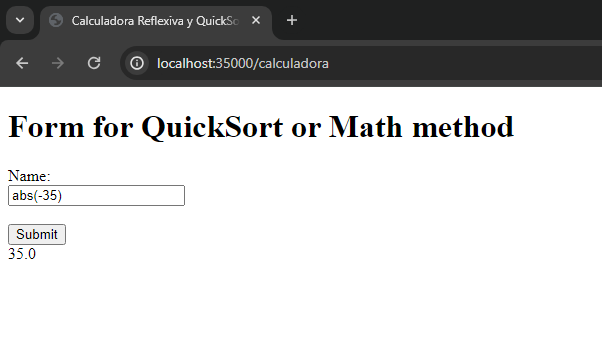
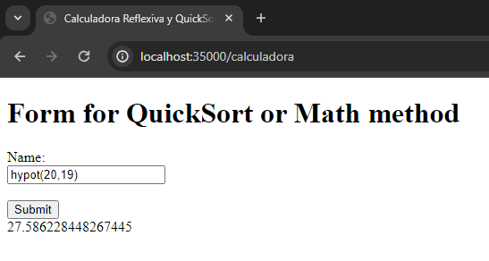

## Parcial práctico - AREP
### _Hecho por Ricardo Pulido Renteria_

Primero, descargamos el respositorio y luego ejecutamos el comando `cd arep-parcial1`

Para ejecutar el proyecto, se deben abrir 2 terminales.
+ En la primera, ejecutamos el servidor de calculadora reflexiva con `java -cp '.\target\classes' com.java.arep.parcial1.ReflexCalc`
+ En la segunda, ejecutamos el servidor de calculadora reflexiva con `java -cp '.\target\classes' com.java.arep.parcial1.FacadeHttpServer`

Hecho esto, vamos a nuestro navegador y accedemos a la ruta http://localhost:35000/calculadora. Aquí podemos hacer 2 tipos de posibilidades a escribir en el campo de texto:

1. Enviar un método de la clase Math de Java junto a sus parámetros

  Ejemplos:

  
  

2. Enviar una lista para ejecutar QuickSort sobre ella
  
  Ejemplo:
